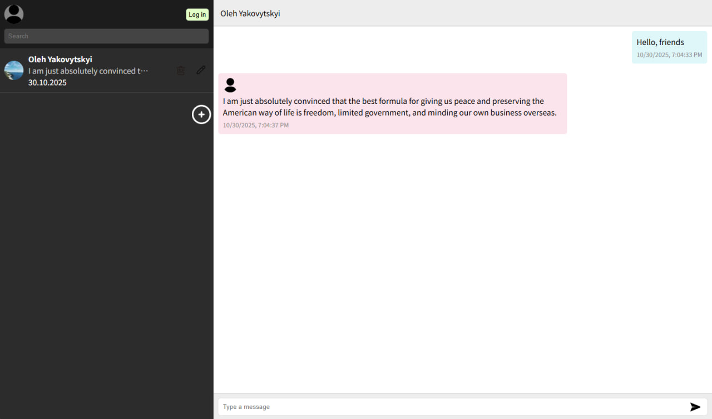

# 💬 Chat with Backend Auto-Response

  
*Preview of the chat application with automatic responses*

This project is a web-based chat application where users can create new chats, delete them, and send messages. Every message sent receives an automatic response fetched from a third-party API (`api-ninjas.com` quotes API).

---

## 🛠️ Technologies

### Backend

| Technology | Purpose |
|-----------|---------|
|  | JavaScript runtime environment |
|  | Server-side framework |
|  | HTTP client for API requests |

### Frontend

| Technology | Purpose |
|-----------|---------|
|  | UI library |
|  | Frontend build tool |
|  | UI components library |

---

## ⚡ Features

- Create new chat conversations.  
- Delete existing chats.  
- Send messages and receive automatic responses (quotes) from a third-party API.  
- Responsive and modern UI using Material UI.  

---

## 🔧 Available Scripts

### Frontend (`client` folder)

```bash
npm install
npm run dev         # Start development server
npm run build       # Build for production
npm run preview     # Preview production build
npm run lint        # Run ESLint
npm start           # Install dependencies and start both frontend and backend concurrently
```

```bash
npm install
npm start           # Start backend server
```

📂 Project Structure

```bash
chat-auto-response/
├─ client/             # React frontend
│  ├─ public/          # Static assets (including preview-chat.jpg)
│  └─ src/             # React components, pages, styles
├─ server/             # Node.js backend
│  └─ server.js        # Main backend file
```
